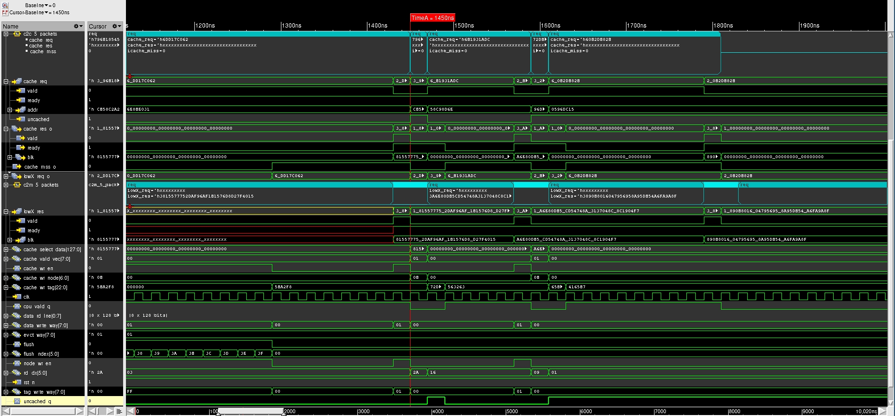

# Cache and LowX Agent UVM Simulation

This project is a UVM-based verification environment specifically designed for the **instruction cache module** of the [tcore-rv32imc](https://github.com/kerimturak/tcore-rv32imc) RISC-V processor project. The environment tests the functionality and robustness of the instruction cache, including cache hits, misses, and uncached operations. The simulation focuses on interactions between the cache and LowX interface.

## Project Status

⚠️ **This project is currently a work in progress (WIP).**  
Some features may be incomplete, and additional development and testing are ongoing. Contributions and feedback are welcome!

---


## Project Overview

### Previous Project: [tcore-rv32imc](https://github.com/kerimturak/tcore-rv32imc)
This repository builds upon the instruction cache module from the **tcore-rv32imc** RISC-V processor design. The instruction cache was originally implemented as part of a 5-stage pipelined RISC-V core supporting the RV32IMC instruction set.

### Current Project
The current project extends the functionality by:
- Creating a UVM-based verification environment for the instruction cache.
- Implementing two agents: one for generating cache requests and another for handling cache misses through the LowX interface.
- Validating cache operations using randomized tests and a scoreboard for result comparison.

---

## Features

- **Cache Agent**: Simulates processor-side cache requests and validates cache responses.
- **LowX Agent**: Simulates memory-side responses to cache misses.
- **Scoreboard**: Tracks and verifies transactions from both agents.
- **PLRU Replacement Policy**: Implements a pseudo-LRU replacement policy for the cache.
- **Randomized Testbench**: Generates constrained random stimuli for comprehensive coverage.

---

## Project Structure

```plaintext
├── src/
│   ├── icache.sv               # Cache module design
│   ├── plru.sv                 # PLRU replacement policy
│   ├── sp_bram.sv              # Single-port BRAM for cache
│   ├── tcore_param.sv          # Core parameters for the cache
├── env/
│   ├── cache_agent.sv          # Cache UVM agent
│   ├── lowx_agent.sv           # LowX UVM agent
│   ├── cache_env.sv            # Combined environment
├── tb/
│   ├── run.f                   # Filelist for simulation
│   ├── base_test.sv            # Base test class
│   ├── new_test.sv             # Specialized test class
├── README.md                   # Project documentation
```

---

## Getting Started

### Prerequisites

- **Simulator**: Cadence Xcelium (only).
- **Git**: Version control system for cloning the repository.
- **SystemVerilog/UVM**: Familiarity with UVM methodology.

### Clone the Repository

```bash
git clone https://github.com/kerimturak/tcore-rv32imc.git
cd cache-uvm
```

---

### How to Run

1. **Navigate to the `tb` Directory**
   ```bash
   cd tb
   ```

2. **Run the Simulation**
   Use the following `xrun` command to run the simulation:
   ```bash
   xrun -gui -access rwc -f run.f
   ```

   - `-gui`: Launches the waveform viewer.
   - `-access rwc`: Allows read, write, and creation access to signals.
   - `-f run.f`: Specifies the filelist containing the design and testbench files.

3. **View the Results**
   - The simulation output will be displayed in the terminal and waveform viewer.
   - Check the UVM reports to verify test success or failure.

---

## Key Components

### Cache Module (`icache.sv`)

Implements a set-associative cache with the following features:
- Configurable size, block size, and number of ways.
- Pseudo-LRU replacement policy.
- Handles cache hits, misses, and uncached requests.

### PLRU (`plru.sv`)

A hierarchical pseudo-LRU algorithm to determine the replacement way in the cache.

### UVM Environment

- **Agents**:
  - `Cache Agent`: Generates cache requests.
  - `LowX Agent`: Responds to cache miss requests.
- **Scoreboard**: Tracks cache hits/misses and validates transactions.
- **Monitors**: Observe transactions on the cache and LowX interfaces.

---

## Contributions

Contributions are welcome! If you'd like to enhance the project, please:
1. Fork the repository.
2. Create a new branch.
3. Submit a pull request.

---

## License

This project is licensed under the MIT License. See the `LICENSE` file for details.

---

## Contact

For any questions or feedback, feel free to reach out:
- **Email**: [kerimturak@hotmail.com](mailto:your-email@example.com)
- **GitHub**: [https://github.com/kerimturak](https://github.com/kerimturak)

